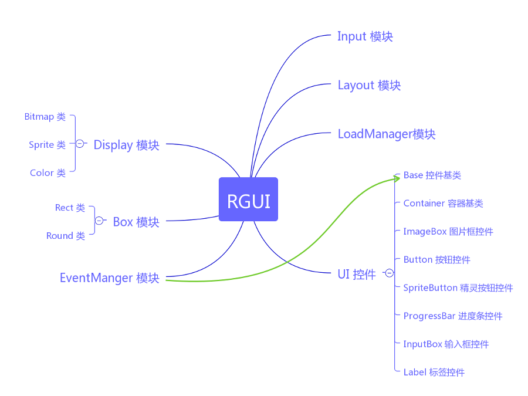

# RGUI
[](https://badge.fury.io/js/rgui)
[](https://gitter.im/rguijs/RMMV)

RGUI is easy to use, powerful, easy to expand and async GUI framework.

## Installation

```
npm install rgui
```
or
```
npm install rgui -g
```

also, you can copy `./src` folder to your project directory.

## Usage
View examples



## Development

```
npm install
```

## License

The gem is available as open source under the terms of the [MIT License](http://opensource.org/licenses/MIT).

